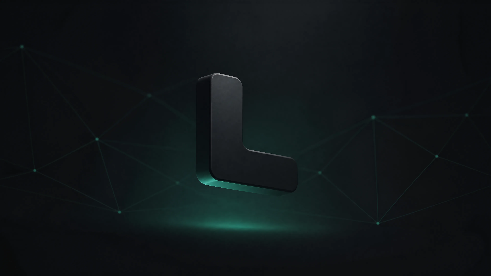

# leocodebox




**leocodebox** 是一个本地优先的 macOS 桌面应用，用来在一个界面里统一管理本机的 AI 编码 Agent CLI —— Claude Code、Codex、Cursor、OpenCode、Gemini CLI、Hermes 与 Grok Build。无需注册、无需云端账号，打开即用。

> English: leocodebox is a local-only macOS desktop app that unifies the management of local coding-agent CLIs (Claude Code, Codex, Cursor, OpenCode) — projects, sessions, skills, MCP servers, and provider configuration — with no cloud account required.

## ⬇️ 下载

[-brightgreen?style=for-the-badge)](https://github.com/leoyb1010/leocodebox/releases/latest)

- **最新版本**：<https://github.com/leoyb1010/leocodebox/releases/latest>
- **当前正式版**：`1.40.4`
- **直接下载 DMG**：[leocodebox-1.40.4-mac-arm64.dmg](https://github.com/leoyb1010/leocodebox/releases/download/v1.40.4/leocodebox-1.40.4-mac-arm64.dmg)（仅 Apple 芯片）
- **SHA-256**：`a8eda70b7f44bdd86347e92c3e849143fa28143781b96de42f468085d4da4fb7`

已 **Developer ID 签名 + Apple 公证**：双击 DMG → 拖入「应用程序」→ 双击运行，无 Gatekeeper 警告，无需 `xattr` 去隔离。

> ⚠️ 本仓库为**私有**，上面的下载链接需要用有本仓库访问权限的 GitHub 账号登录后才能下载。若要让任意人一键下载，需把仓库或该 Release 改为公开。

---

## ✨ 特性

- **本地优先，无 leocodebox 云端依赖**：打开 App 自动在 `127.0.0.1:38473` 启动本地服务，退出即停止并释放端口。项目索引、会话索引和工作台配置保存在本机。
- **多智能体统一管理**：在一个界面里管理 Claude Code / Codex / Cursor / OpenCode 的认证、模型、权限模式、会话、技能和 MCP，并集中检查 Gemini CLI、Hermes 与 Grok Build。
- **跨设备发现本机 CLI**：从登录 Shell 和 npm、Homebrew、Volta、nvm、mise、asdf、fnm、bun、pnpm、yarn 等常见安装位置合并运行路径；支持 `CLAUDE_CONFIG_DIR`、`CODEX_HOME`、`OPENCODE_CONFIG_DIR`、`OPENCODE_DATA_DIR` 与 XDG 自定义目录。
- **实时 CLI 版本与安全更新**：识别 npm、Homebrew、pnpm、Volta、Bun 和官方独立安装器；支持逐个或批量更新，无法自动更新时提供可复制的安全命令，不会误装第二份 CLI。
- **模型列表自动跟随 CLI**：模型目录随本机 CLI 更新自动刷新（例如 Codex 升级后自动出现新一代模型），带源文件指纹失效机制。
- **Leoapi 接口切换**：接口配置切换器内置在应用内（不跳外部 App），支持多个请求地址、自动选择最快可用地址、模型列表读取、真实模型测速、Claude Sonnet/Opus/Haiku 映射、备份恢复，并可从旧切换器数据库（`~/.cc-switch/cc-switch.db`）一键导入。
- **项目按 Agent 分类**：侧边栏项目列表按 Claude / Codex / OpenCode / Cursor / Gemini 显示彩色会话计数徽章，并过滤一次性/临时目录，只留真实项目。
- **简体中文默认**，深色/浅色/跟随系统主题。
- **桌面模式完全免登录**：本地能力 token 由 Electron 自动注入，只允许本机应用访问；不显示账号密码页。
- **应用内热更新**：1.39.1 起默认使用公开签名资产源，在“设置 → 关于”即可检查、下载并重启安装，无需 GitHub Token；源码仓库仍保持私有。
- **签名 + 公证发布**：提供 Apple Developer ID 签名并经 Apple 公证的 DMG，别人下载双击即可运行，无 Gatekeeper 警告。

## 🖥️ 支持的 Agent

| Agent | 说明 | 认证方式 |
|---|---|---|
| **Claude Code** | Anthropic 官方 CLI | `claude /login` / API Key / settings.json |
| **Codex** | OpenAI Codex CLI | ChatGPT 登录 / `OPENAI_API_KEY` |
| **Cursor** | Cursor Agent CLI | `cursor-agent login` |
| **OpenCode** | OpenCode CLI | OAuth / Provider API Key |
| **Gemini CLI** | Google Gemini CLI | Google 登录 / API Key |
| **Hermes** | Nous Research Hermes Agent | 本机 CLI 配置 |
| **Grok Build** | xAI Grok Build TUI | 本机 `grok` 配置 |

> Agent CLI 本身不打包在应用内。每台 Mac 安装 leocodebox 后，应用会检测并驱动该设备上已安装的 CLI；Agent 的登录与网络请求仍直接连接各自服务商。

## 🏗️ 架构

```
┌─────────────────────────────────────────────┐
│  Electron 外壳 (electron/)                    │
│  · 启动台 launcher + 多 Tab (BrowserView)     │
│  · 生命周期：启动拉起服务 / 退出停止服务         │
└───────────────┬─────────────────────────────┘
                │ 本地 HTTP 127.0.0.1:38473
┌───────────────▼─────────────────────────────┐
│  本地服务 (server/) — Node + Express          │
│  · Providers / Projects / Sessions / MCP      │
│  · 技能 / 代码仓库 / Leoapi / 本地接口        │
│  · SQLite  ~/.leocodebox/auth.db               │
└───────────────┬─────────────────────────────┘
                │ 静态托管
┌───────────────▼─────────────────────────────┐
│  前端 (src/ → dist/) — React + Vite           │
│  · Tailwind + shadcn/ui · react-i18next        │
│  · CodeMirror 编辑器 · xterm 终端              │
└─────────────────────────────────────────────┘
```

- **技术栈**：Electron · Node/Express · SQLite(better-sqlite3) · React 18 · Vite · TypeScript · Tailwind CSS · react-i18next
- **平台**：macOS **arm64**（Apple 芯片）

## 📦 安装

从 Releases 下载已签名并公证的 DMG（macOS Apple 芯片）：

1. 双击 DMG，把 **leocodebox** 拖入「应用程序」。
2. 双击运行——已 Developer ID 签名 + Apple 公证，无需 `xattr` 去隔离。
3. 首次打开自动启动本地服务，直接进入界面。

## 🔧 从源码构建

```bash
# 依赖
npm install

# 开发（前端 + 服务并行）
npm run dev

# 桌面开发（Electron 指向本地服务）
npm run desktop:dev

# 完整构建（前端 + 服务）
npm run build

# 打包桌面 DMG（自用 adhoc 签名）
npm run desktop:dist:mac
```

质量检查：`npm run typecheck` · `npm run lint`

> 注意：运行时原生依赖（better-sqlite3 等）按 Electron ABI 编译，服务端脚本需用 Electron 的 Node 运行。

## 🖊️ 签名与公证（对外分发）

要产出别人下载双击即可运行的 DMG，需要 Apple Developer ID 证书 + 公证。完整步骤见 **[docs/SIGNING.md](docs/SIGNING.md)**：

```bash
# 一次性：Xcode 创建 Developer ID Application 证书 + 存公证凭据
xcrun notarytool store-credentials leocodebox --apple-id <id> --team-id <TEAMID> --password <app专用密码>

# 每次出正式版
export LEOCODEBOX_SIGN_IDENTITY="Developer ID Application: <名字> (<TEAMID>)"
npm run desktop:dist:mac:signed     # 签名并打包 DMG
npm run desktop:notarize:mac        # 提交 Apple 公证 + 钉章
```

## 📁 项目结构

```
electron/        Electron 主进程、启动台、窗口/Tab 管理、本地服务生命周期
server/          本地 Node/Express 服务：providers / projects / sessions / mcp / git / Leoapi
src/             React 前端（组件、hooks、i18n、状态）
shared/          前后端共享工具
build/           签名 entitlements
scripts/release/ 构建、暂存、签名、公证脚本
docs/            SIGNING.md 等文档
dist/ dist-server/  构建产物（不入库）
```

## 🔒 本地与隐私

- 服务绑定 `127.0.0.1`，桌面模式用每次启动生成的本地能力 token。
- leocodebox 云账号和托管 Agent 环境在本构建中禁用；应用更新仅在用户主动配置 GitHub 凭据或通用更新源后启用。
- 智能体凭据保留在各命令行工具的本机配置目录；Leoapi 数据以 `0700/0600` 权限保存在 `~/.leocodebox/switch/`，应用更新凭据由 macOS 钥匙串加密。

## 📄 许可与归属

leocodebox 以 **AGPL-3.0-or-later** 分发。

本项目基于 CloudCLI UI（`https://github.com/siteboon/claudecodeui`），并在 `LICENSE` 与 `NOTICE` 中保留所需的法律声明与第三方归属。请勿移除这些声明。
